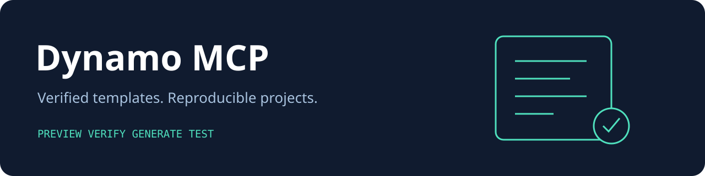

# Dynamo MCP v2

Create a small, tested software project from an approved template. Dynamo shows the exact files first, verifies the template fingerprint, then writes a new project without running template scripts or downloading code.

This is a security focused alpha release. The old Python Cookiecutter service is retired because it allowed executable templates and unrestricted output paths. Its historical documentation remains in [the migration archive](docs/legacy-README.md).

## Capabilities

| Capability | Available behavior |
|---|---|
| Project types | Node CLI, Node library, Python CLI |
| Preview | Complete rendered files and deterministic SHA256 digest |
| Template integrity | Bundled JSON templates pinned by digest in a reviewed manifest |
| Generation | Private operator directory, exclusive reservation, staged atomic source publication |
| Security | No hooks, no remote downloads, no arbitrary paths, no overwrite, file and project quotas |
| Agent tools | Official MCP SDK 2 stdio server, six tools, policy resource |
| Evaluation | Generated project tests, hostile fixtures, SDK integration tests, local benchmark |
| MetaHarness | [Maintainer/security/release/benchmark profiles, sessions, field memory adapter, host configs](.harness/generated/README.md) |
| Autogenous | [Actual upstream fitness gates](.harness/autogenous/README.md), automatic promotion disabled |

## Install and try

Requires Node 22 or 24, npm, and Python 3.11+ for Python template tests. Linux is the validated generation platform.

```bash
git clone https://github.com/ruvnet/dynamo-mcp.git
cd dynamo-mcp
npm ci --ignore-scripts
npm test
node src/cli.mjs list
node src/cli.mjs preview '{"template":"node-cli","name":"my-project"}'
```

Create an operator owned output directory with private permissions. Existing project names are never overwritten.

```bash
mkdir -m 700 "$HOME/dynamo-projects"
export DYNAMO_OUTPUT_ROOT="$HOME/dynamo-projects"
export DYNAMO_ALLOW_GENERATE=1
node src/cli.mjs generate '{"template":"node-cli","name":"my-project"}'
cd "$DYNAMO_OUTPUT_ROOT/my-project/source"
npm test
npm start
```

A generated `harness.json` declares validation and ecosystem links; it is not an installed full MetaHarness. The full working MetaHarness belongs to this repository and is installed separately using the linked guide.

## MCP and CLI

Start `node /absolute/path/dynamo-mcp/src/cli.mjs mcp` from your MCP host. Stdio access inherits the launching operator's authority. No HTTP server is exposed. Generation additionally requires both environment variables above. Validation requires `DYNAMO_ALLOW_VALIDATION=1`; no tool accepts a shell command, environment map, or output directory.

| CLI command | MCP tool |
|---|---|
| `list` | `templates_list` |
| `preview JSON` | `template_preview` |
| `generate JSON` | `project_generate` |
| `status` | `project_status` |
| `test` | `project_validate` |
| `benchmark` | `project_benchmark` |

Resource: `ruv://dynamo-mcp/policy`. CLI `test` is explicit local authorization to run the fixed core suite. `npm test` runs the complete suite, including the MCP client. MCP validation runs the core suite without recursive MCP invocation. Benchmarks measure local template verification and rendering only.

## Operations and limits

Inputs are capped at 32 KiB, MCP frames at 64 KiB, templates at 256 KiB, files at 64 KiB and 64 per bundle, generated projects at 100 per output root. One generation holds a root lock; two tool calls may be active. Validation is one fixed subprocess with a 30 second deadline and 64 KiB output cap; environment secrets are not forwarded.

A crash leaves a lock and potentially a private staging directory. Stop all Dynamo instances, inspect the incomplete project, and remove the stale lock and incomplete reservation manually before retrying. Dynamo never guesses that a lock is stale. Atomic visibility of the `source` directory does not guarantee power loss durability. Protect the root and its parents from other writers; this is not isolation from another process running under your own account. Hash receipts prove content consistency, not trusted authorship.

## Development and delivery

```bash
npm test
npm run benchmark
npm audit
```

CI runs Node 22 and 24, all project and SDK tests, audit, and benchmark artifact upload. Tagged releases create a source archive as a CI artifact; no registry or live deployment occurs automatically. [ADR](docs/adr/0001-inert-pinned-template-generation.md), [security review](docs/security-review.md), and [validation evidence](docs/evidence/README.md) document scope and limitations.

## RuV ecosystem

[RuFlo](https://github.com/ruvnet/ruflo) coordinates work. [MetaHarness](https://github.com/ruvnet/metaharness) evaluates changes. [Autogenous](https://github.com/ruvnet/autogenous) supplies fitness gates. [Guardrail](https://github.com/ruvnet/guardrail) evaluates policy. [Federated MCP](https://github.com/ruvnet/federated-mcp) provides bounded federation reads. [x.ruv.io MCP](https://x.ruv.io/mcp) is a separate federation service; Dynamo does not publish federation messages or acquire credentials.
